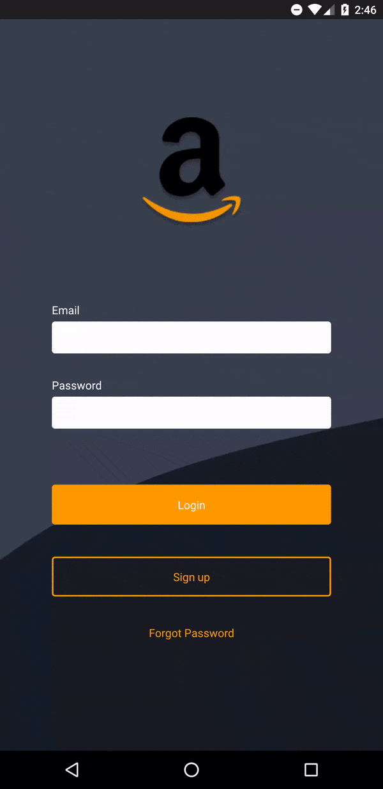

<h1 align="center">
    
    
</h1>

<h3 align="center">
  Amazon Redux Redesign
</h3>
<p align="center">
  A react native Amazon app using Flux architecture
</p>

<p align="center">
  
  
  

  
  
  

</p>

:iphone: The App
------------------
This app was made during GoStack Bootcamp! The idea was creating an app for buying sneakers using react-native and Redux!
I inpired this app in a fake Amazon Redesign, still using the products avaliable in the bootcamp api!
The GoStack Challenge original GitHub page can be seen [here](https://github.com/Rocketseat/bootcamp-gostack-desafio-07#desafio-07-redux)
(Brazilian Portuguese)

#### Changes and Implementations!
Compare my changes to the [*bootcamp correction*](https://github.com/Rocketseat/bootcamp-gostack-desafio-06/)

- Created an Amazon based app!
- Translated the products in the API!
- Used USD as currency!
- *Used a function/hooks format instead of a class/state* **(useState | useEffect | useMemo)**
- *Used Redux with React Hooks* **(useSelector | useDispatch)**

:camera: See it for yourself
----------------------

<p align="center">
  

</p>

:wrench: Technologies used:
----------------------
- [**ReactNative**](https://facebook.github.io/react-native/)
- [**React Hooks**](https://reactjs.org/docs/hooks-intro.html)
- [**Redux**](https://redux.js.org/basics/usage-with-react/)
- [**react-navigation**](https://reactnavigation.org/)
- [**react-native-vectoricons**](https://github.com/oblador/react-native-vector-icons)
- [**Styled Components**](https://styled-components.com/)
- [**Reactotron**](https://github.com/infinitered/reactotron/blob/master/docs/quick-start-react-native.md)
- [**Eslint**](https://eslint.org/)
- [**Prettier**](https://prettier.io/)
- [**Genymotion**](https://www.genymotion.com/)

## :information_source: How to use this project
To clone and run this application, you'll need to follow ReactNative [*getting started guide*](https://facebook.github.io/react-native/docs/getting-started)

```bash
# Clone this repository
$ git clone https://github.com/lucascassilha/amazon-redesign

# Go into the repository
$ cd amazon-redesign

# Install dependencies
$ yarn

# Run the app
$ yarn react-native | run-android or run-ios |
```
You will need a [emulator](https://genymotion.com) running, or a device with debug mode on!


## :scroll: License

This project is under the [MIT license](LICENSE)

:speech_balloon: Reach me
----------

[*In case you want to reach me*](https://www.linkedin.com/in/lcassilha/)


Thank you for taking a look at my project! Made with ♥
